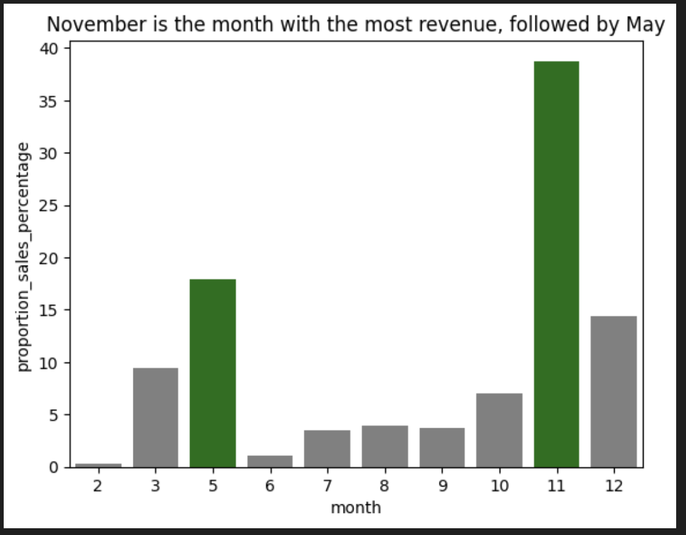
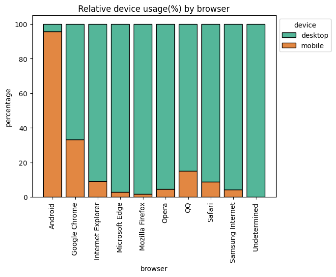
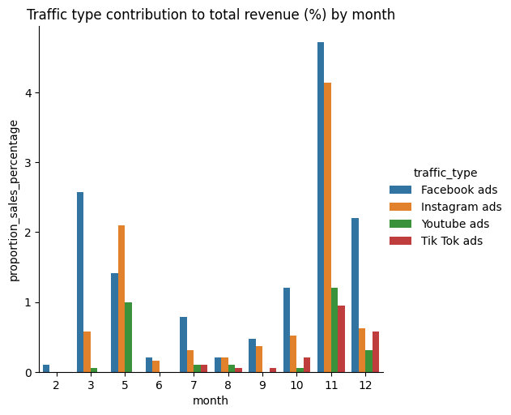

# Exploratory Data Analysis (EDA): Online Shopping in Retail

[](https://open.vscode.dev/selvatica-36/Exploratory-data-analysis---Online-shopping-in-retail)      

## Stack
      


## Project Description
✨ **Welcome** to this comprehensive **end-to-end EDA project** where we will uncover and analyse trends, patterns and anomalies in **retail customer activity data**. The dataset used here belongs to an anonymised multinational retail company (provided by AiCore), and contains yearly online sales data and general website performance data. 

🔭 **The first part of the project focuses on data exploration and cleaning.** We will first develop an ELT pipeline: the data will be extracted from an AWS RDS database, loaded as a dataframe and cleaned for analysis by transforming column data types and dealing with missing data. The data will also be prepared for ML by dealing with outliers, overly correlated columns and data skewness. 

📊 **The second part of the project focuses on data analysis to uncover business insights.** We will answer relevant business questions regarding sales trends, marketing strategy, website performance and customer behaviour. To do so, we will generate informative data visualisations and **offer insights and recommendations**.


## Table of Contents
1. [Installation instructions](#1-installation-instructions)
3. [Usage instructions](#3-usage-instructions)
4. [File structure](#4-file-structure)
5. [License information](#5-license-information)

## 1. Installation instructions
All needed files are stored in this Github repo: https://github.com/selvatica-36/Exploratory-data-analysis---Online-shopping-in-retail

This project has been developed within a custom conda environment. Upon creating the environment, I installed `pip` and then used `pip install` command to download from the PyPI library all modules and dependencies needed for the project. 

1. All environment requirements have been uploaded to the repo in two different formats: `environment.yml` and `requirements.txt`. Depending on your OS and/or your preference of virtual environment, you will need one or the other. 

    1a. To install environment into a python virtual environment, run: `pip install -r requirements.txt`

    1b. To install environment into a conda virtual environment, run: `conda env create --name environment_name -f environment.yml`

2. Clone repo locally and/or fork it to a separate github account.
3. Run scripts/notebooks as needed.

## 2. How to use this repository

PYTHON SCRIPTS
- `db_utils.py`: Contains utility class and methods to connect to AWS RDS and download the dataset locally. 
- `info_extractor.py`: Contains class with methods to extract dataframe information and slice the dataframe as needed.
- `transformer.py`: Contains class with methods to perform data cleaning and transformations on the dataframe.
- `plotter.py`: Contains class with methods to perform some data visualisations such as discrete and continuous distributions, correlation matrices and quantile-quantile plots.
- `statistical_tests.py`: Contains class with methods to perform sstatistical tests on the data, such as chi2 or Agostino's K2 normality test.
- `outlier_detector.py`: Contains class with methods to perform statistical tests and detect outliers in the data.

JUPYTER NOTEBOOKS
- `EDA_customer_activity.ipynb`: Notebook containing the full EDA process and the data cleaning and transformations: handling of nulls, skewness and collinearity analysis.
- `business_analysis_report.ipynb`: Notebook containing the final business analysis and visualisations, in response to various queries  of interest.

DATA FILES
- `customer_activity.csv`: Raw dataset downloaded from RDS
- `ML_preprocessed_data.csv`: preprocessed dataset ready for ML algorithms. Processing has dealt with data types, missing data (imputing nulls/dropping rows) and overly correlated columns (by dropping column). Data has also been transformed to fit a normal distribution.
- `cleaned_skewed_data.csv`: preprocessed dataset for data analysis and visualisation. Processing has dealt with data types and missing data (imputing nulls/dropping rows) only.


## 3. Technologies, modules and libraries 

### 3.1. Technologies

- **AWS**: Used for cloud-based services and storage.
- **Jupyter Notebooks**: Used for data exploration and analysis.

### 3.2. Python modules and libraries

`pandas`: fast, powerful, flexible and easy to use open source data analysis and manipulation tool.

`sqlalchemy`: toolkit for SQL interaction and an Object-Relational Mapping (ORM) library for database operations.

`numpy`: library that provides powerful and versatile array computations, mathematical functions and other tools for data analysis and visualisation.

`matplotlib`: library for creating static, animated, and interactive visualizations in Python.

`seaborn`: library for making statistical graphics in Python. It builds on top of matplotlib and integrates closely with pandas data structures.

`scipy.stats`: SciPy is a collection of mathematical algorithms and convenience functions built on NumPy. `stats` is a subpackage that provides statistical distributions and functions.

`statsmodels`: library that provides classes and functions for the estimation of many different statistical models, as well as for conducting statistical tests, and statistical data exploration.

`missingno`: library that provides a series of visualisations to understance the presence and distributions of missing data within a pandas dataframe.

`math`: module that provides access to the mathematical functions.

`tabulate`: library and a command-line utility to pretty-print tabular data in Python.

`yaml`: library for working with YAML files.

`os`: module that provides a portable way of using operating system dependent functionality e.g. save a downloaded file on a local folder.

## 3. Understanding the dataset
### *Online customer activity in a multinational retail company*

| Column name               | Column description                                                                                                                                     |
|---------------------------|--------------------------------------------------------------------------------------------------------------------------------------------------------|
|  administrative           |  Columns which indicates which administrative activity the user was performing on their account. Encoded as a number.                                                       |
|  administrative_duration  |  How long a user performed administrative tasks in that session.                                                                                       |
|  informational            |  Indicates which informational activity the user was performing on the website. Encoded as a number.                                                                        |
|  informational_duration   |  How long a users performed informational tasks in seconds during that session.                                                                        |
|  product_related          |  Indicates which product the user was viewing on the website. Encoded as a number.                                                                                          |
|  product_related_duration |  How long a user browsed products during that session.                                                                                                 |
|  bounce_rates             |  Historical bounce rate of that particular page for all users. They visited the directly and immediately exited. Heavily correlated with 'exit_rates'. |
|  exit_rates               |  Historical exit rate of the users from that particular page.                                                                                          |
|  page_values              |  The average value contribution of a page to a customer sale                                                                                           |
|  month                    |  Month the users activity took place                                                                                                                   |
|  operating_systems        |  Operating system the user was using                                                                                                                   |
|  browser                  |  The browser used by the user                                                                                                                          |
|  region                   |  The region the user originated from                                                                                                                   |
|  traffic_type             |  How the user was redirected to the site                                                                                                               |
|  visitor_type             |  Whether a customer was is new/returning or other                                                                                                      |
|  weekend                  |  Whether the activity only took place during the weekend                                                                                               |
|  revenue                  |  Whether the customer purchased anything that session                                                                                                  |


## 4. Project Workflow: Extract-Load-Transform (ELT) Pipeline Architecture and EDA Methods

The figure below shows the general workflow used to **extract, load and transform (ELT)** the data. As part of this process, I performed **exploratory data analysis (EDA)** to decide when and how to clean and transform the data. For all these purposes, I created custom methods encapsuled in various classes, as detailed below. 

1. Data extraction was performed by running the db_utils.py script directly.
2. Data loading was performed directly on the jupyter notebook `EDA_customer_activity.ipynb`.
3. EDA was performed on the jupyter notebook `EDA_customer_activity.ipynb`.
4. Data transformations were performed directly on the jupyter notebook `EDA_customer_activity.ipynb`, but could also be coded on the `__main__ == '__name__'` part of the `transformed.py` script.

*Note:* the figure below does NOT contain all methods used for EDA, but rather some relevant examples.


## 5. Business insights and recommendations: Summary

For the full analysis, check the notebook `business_analysis_report.ipynb`.

### 5.1. What are our customers doing?
#### **Insights**
GENERAL SALES
- 77% of total sales happen during the week, whereas 23 % of total sales happen on the weekend.
- 39% of total sales happen in North America, followed by 17% in Western Europe. Oceania is the weakest market, making up 2.6% of total sales.
- Google search brings more than 45% of total revenue, followed by Facebook ads (12%). Tiktok ads and facebook pages are amongst the least successful.
- November is the month with the most revenue (38%) followed by May (17.5%). February and June are bring the least revenue (<1%).

<div style="text-align: center;">

</div>

WEBSITE ACTIVITY
-  Per visit, a user spends 89% of their time in product-related tasks, 8.7% in administrative tasks and 2.2% on informational tasks, on average. 
    - There are a total of 296 product-related tasks, 24 administrative tasks and 13 informational tasks.
    - The total amount of hours spent by all users combined in each task are:
        - 4047 hours in product-related tasks.
        - 269.5 hours in administrative tasks.
        - 114.5 hours in informational tasks.
- On average, users spents most time doing administrative tasks '21' and '17', and informational tasks '8' and '10'. However, there is **high variability** in the most pupular tasks amongst the user base.

#### **Recommendations**

1️⃣ Offer sales and discounts during February and June.

2️⃣ Increase advertising budget on TikTok and Instagram as they are more frequently used than facebook.

### 5.2. What software are our customers using the most to access the website?
#### **Insights**
OERATING SYSTEMS AND DEVICES
- The three most used operating systems are: Windows (53.5%), MacOS (21.7%) and Android (21%). The least used systems are Ubuntu (0.07%) and ChromeOS (0.05%). **Out of the mainstream systems, iOS only takes 3%.**
- 76% of users access the website through desktop and **24% via mobile.**
- Breakdown of OS usage by region: trend seems to be consistent across all regions.


BROWSER SUPPORT
- The three most used browsers are: Google Chrome (65.6%), Safari (20.5%) and Mozilla Firefox (6.7%). **All three were accessed more often through desktop than mobile** (60-95% of the time).
- Minimal impact: The only browser that was accessed more often via mobile was Android (0.98% of visits), with 95% of Android users accessing via mobile.

<div style="text-align: center;">

</div>

#### **Recommendations**

1️⃣ **Improve mobile accessibility to the website.** Data shows most users access through desktop, which can indicate that the website does not work as well on mobile.

### 5.3. Do we need to optimise the marketing strategy?
#### **Insights**
- Google search traffic contributes the most to revenue across all regions (40-50%). Facebook ads is the second highest contributor in all regions except for South America, where Bing search takes second place. Trends are fairly similar across all regions.


- Youtube and Instagram ads have the highest bounce rates across the board. Google search, Instagram pages and Pinterest have the lowest bounce rates. Asia is an exception with Yahoo search having the highest bounce rate.

- November generated the most sales from ads traffic (11% of total sales), followed by May and December. February generated the least amount of sales from ads traffic (0.1%). Facebook ads generate the most sales across all months except for May, where instagram ads where most successful.

<div style="text-align: center;">

</div>

#### **Recommendations**

1️⃣ Spend less or cut Youtube ads. Youtube ads are not effective: they have the highest bounce rate and bring very little revenue.

2️⃣ Spend more on instagram ads. Instagram ads have the potential to bring more revenue: the bring about 10% of revenue, despite the high bounce rates. Out of all sial ad platforms, instagram comes second every month except for May, where instagram ads where the most sucessful.

3️⃣ Keep investing on instagram pages. They are effective (low bounce rates) even if they only bring < 5 % of revenue.

### 5.4. Detailed sales breakdown
#### **Insights**
NEW VS. RETURNING VISITORS
 - Most purchases are made by returning visitors (79.5%). 
 - Returning visitors make up 86.7% of total visitors. Out of all returning visitors, 14% of them make a purchase.
 - Out of all new visitors, 24% of them make a purchase.

WEEK VS. WEEKEND SALES
 - The percentage of visitors making a purchase on the weekend (16.9%) is marginally higher than the percentage of visitors making a purchase during the week (15%). However, as we analysed in Part 1, most sales happen during the week (77%) because the number of total visitors Monday-Friday is x3.8 times higher than during the weekend.

TRAFFIC TYPE CONTRIBUTION TO SALES
- Search traffic is contributing the most to total sales (55%), followed by ads traffic (27.7%), social traffic (15.9%) and direct traffic (1.3%).

#### **Recommendations**

1️⃣ Offer rewards and discounts for returning visitors. 

2️⃣ Offer discounts to weekend visitors to entice weekend sales. 

3️⃣ Increase budget in ads and social traffic. This should be done at the same time as increasing mobile accesibility to the website. 

## 6. File Structure
```
├──data
│   ├── cleaned_skewed_data.csv  #Cleaned data for analysis
│   ├── ML_preprocessed_data.csv #Cleaned and transformed data for ML 
│   └── customer_activity.csv #Data downloaded fron RDS database 
├── readme-images
│   └── EDA_flow_chart.png
├── scripts
│   ├── db_utils.py
│   ├── info_extractor.py
│   ├── outlier_detector.py
│   ├── plotter.py
│   ├── statistical_tests.py
│   └── transformer.py 
├── EDA_customer_activity.ipynb
├── business_analysis_report.ipynb
├── requirements.txt
├── environment.yml
├── .gitignore
├── README.md

```

## 7. License information
This is an open source public repository. The dataset was obtained from Aicore. AiCore provided the necessary credentials to download the dataset from AWS RDS (these are not publicly available).
